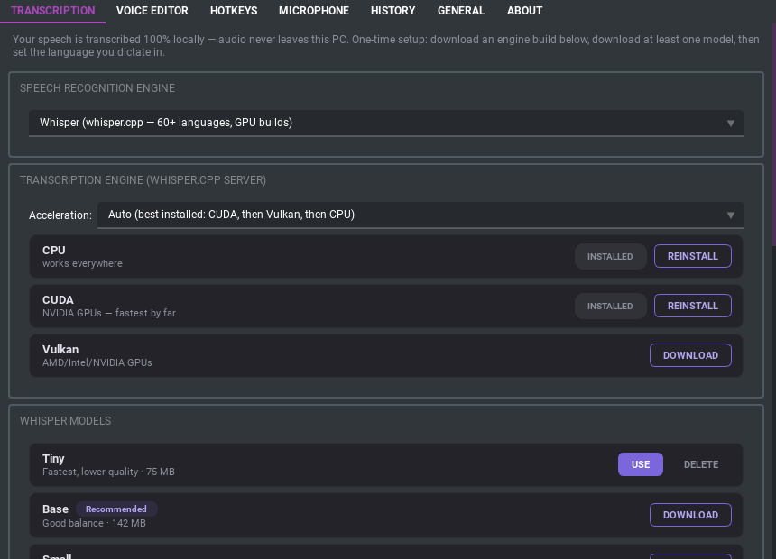
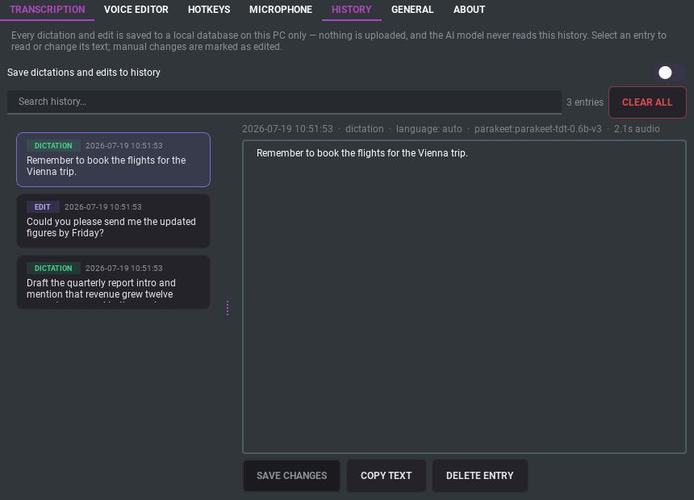
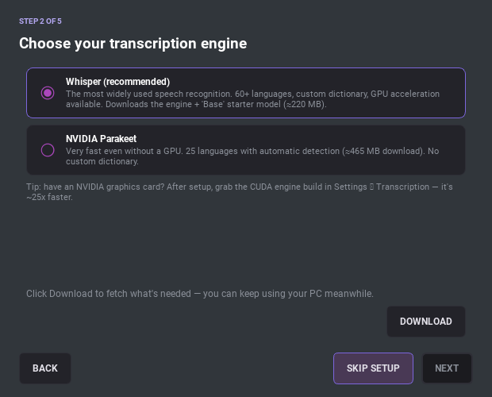
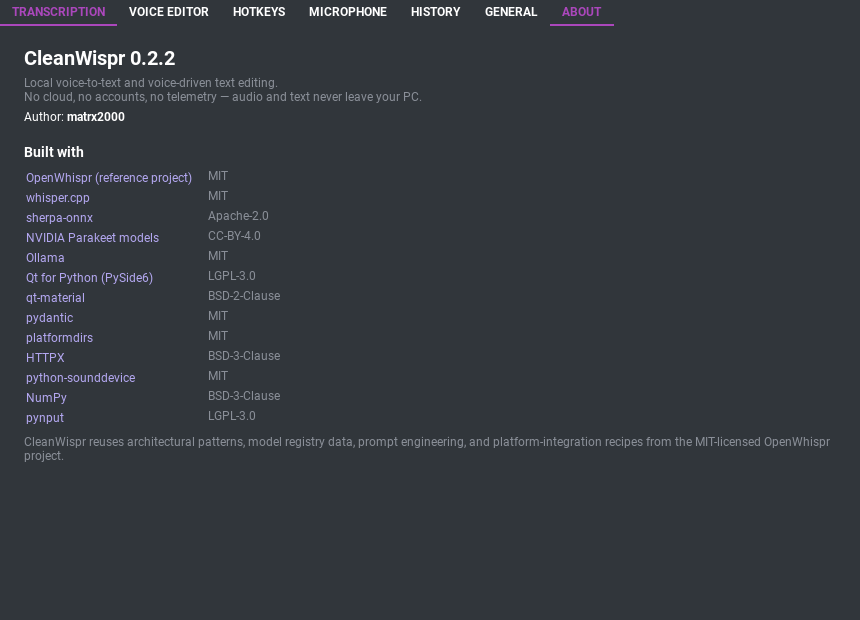

# CleanWispr

**Version 0.3.0** · Local voice-to-text, voice-driven text editing, and voice notetaking for Windows 10/11 and Linux (experimental macOS). Python + PySide6. **No cloud, no accounts, no telemetry — audio and text never leave your PC.**

## What it does

**🎙 Dictation** — press a global hotkey in any application, speak, and the transcript is pasted at your cursor. Powered by [whisper.cpp](https://github.com/ggerganov/whisper.cpp) running locally as a warm background server, so transcription starts instantly. With **live typing** (on by default), words appear in the target app *while you're still speaking*: only words two consecutive recognition passes agree on are typed, and when you stop, the final transcript corrects the preview in place — so you get instant feedback without garbled text.

**✏ Voice editor** — select text anywhere, press the editor hotkey, and speak a command: *"make this formal"*, *"remove the second sentence"*, *"translate this to English"*. A local LLM (via [Ollama](https://ollama.com)) applies the edit and the result replaces your selection. With nothing selected, it writes new text from your command.

**📝 Notes** — a built-in notetaking window (its own hotkey, or tray → *Open Notes…*) with a WYSIWYG Markdown editor: headings, lists, checklists, colours, tables, and paste-in images. Organise notes into **vaults** and folders, and use the on-screen slider to **dictate** into a note or run an **AI take** (rewrite the selection, or append generated text) — all still fully local.

**🎭 Skills** — reusable *roles* for the voice editor and Notes AI: *"a formal editor"*, *"a witty poet"*, or the built-in **Tables** helper that keeps Markdown tables rendering cleanly. Activate one or several (they **stack**), switch hands-free by voice (*"switch to poet"*, *"plain"* to clear) or from the tray, and manage them in **Settings → Skills** — add, edit, set voice triggers, per-skill temperature/model, and **import/export as JSON** to share. A skill only shapes tone and formatting; the app keeps control of the output, so a persona can't break the paste-only result.

**🛠 Tools** — skills say *how* the model should write; tools are *what it can do*. Small Python capabilities the voice editor's LLM can execute while answering: fetch and read a web page, run a calculation in a sandboxed Python subprocess, or — when you ask it to — **create a brand-new tool** for you (it ships with a built-in *Tool author* skill that teaches it the format; new tools stay disabled until you review and enable them). Manage everything in **Settings → Tools**: per-tool switches, an ask-before-every-call mode, **import/export as .zip**, and a separate **web-access switch (off by default)** with a clear warning about the risks of feeding web content to a local model.

## Screenshots

| Model manager (Settings → Transcription) | History browser |
|---|---|
|  |  |

| Guided first-run setup | About |
|---|---|
|  |  |

## Feature overview

| Area | Highlights |
|---|---|
| **Transcription** | Two engines: **whisper.cpp** (CPU / **CUDA** / Vulkan builds, Metal on macOS; 6 model sizes Tiny → Large-v3 + Turbo; 60+ languages; custom dictionary) and **NVIDIA Parakeet** via sherpa-onnx (in-process, extremely fast even on CPU; multilingual v3 with auto language detection). All models downloaded in-app with progress **and cancel**; the engine-build picker **auto-detects your GPU** and marks the recommended build (CUDA/Vulkan/CPU) |
| **Voice editor** | Ollama model auto-discovery with parameter/quantization/context info; **hardware-aware model recommendations** (best-quality vs. smallest-usable for your GPU/RAM); **searchable model library** across families (Gemma, Qwen, Llama, Mistral, Phi, DeepSeek…) with **one-click install** — or install anything by name via `ollama pull …` (name-only extraction, nothing executed); auto-starts Ollama if it isn't running; hardened prompts (selection is data, output-only). The install/recommend flow is provider-agnostic — a future non-Ollama backend gets it for free |
| **Live feedback** | **Live typing**: dictated words stream into the target app while you speak (stable-prefix commits via the LocalAgreement-2 policy; the final transcript then fixes the preview in place with a minimal backspace-and-retype delta). Automatically skipped in terminals, paused while hotkey modifiers are held, frozen if you switch windows (text lands on the clipboard instead). Overlay pill narrates every stage: mic warm-up → recording (level-reactive) → transcribing → model loading (with seconds counter) → writing → pasting; **thinking panel** streams reasoning models' thoughts as markdown, with the exact command + selection that was sent; synthesized audio cues (toggleable) |
| **Tools** | User-installable Python capabilities the LLM can call via **Ollama function calling** (capability-detected per model): built-in **HTTP fetch** (page → readable text), **Run Python** (sandboxed snippet execution, asks permission per call), and **Create tool** (the model writes new tools on request — always created disabled for review). Tools run in an isolated `python -I` subprocess with a hard timeout and output cap; exchanged as **.zip** files; governed by per-tool switches, an optional confirm-everything mode, and a default-off **web access** switch with an explicit prompt-injection warning. Built as a standalone, reusable `toolkit` package |
| **Notes** | A standalone notetaking workspace with a WYSIWYG Markdown editor (headings, lists, checklists, inline code, custom text/highlight colours, full tables with row/column/merge/split ops) and **paste-or-drop images** saved as attachments beside the note. Multiple **vaults** (folders you can add, switch, sync, or back up as a unit) with project subfolders; notes stored as portable HTML with Markdown export. A gated-shifter **slider** drives voice input — slide left to **dictate** into the note, right for an **AI take** (edit the selection, or append generated text), up to peek raw Markdown, down to undo the last voice insert |
| **Skills** | Reusable personas/roles layered onto the voice editor and Notes AI as a tone-and-formatting *style* — **injection-hardened** so a user-written persona can't break the output contract (nonce-fenced data, guardrail sandwich). **Stackable** (several active at once), with per-skill temperature/model overrides and **voice switching** (*"switch to poet"*, *"use the concise skill"*, *"plain"* to clear). Ships built-in skills including a **Tables** formatter that keeps Markdown tables rendering correctly in Notes (on by default); manage them via a "/" quick-switch palette, a tray submenu, and a **Settings → Skills** editor with **JSON import/export** to share skills. Built as a standalone, reusable `skillkit` package |
| **Hotkeys** | Three global shortcuts (dictation / editor / notes), click-to-capture UI, toggle or push-to-hold per slot, Esc cancels, overlap-conflict validation across all slots with clear explanations |
| **History** | Searchable local SQLite log of every dictation and edit (with instruction + original text for edits); entries are editable with an "edited" audit flag; confirmed clear-all; audio recordings NOT kept unless you opt in |
| **Robustness** | Single-instance lock; inference servers die with the app (job object / PDEATHSIG) — no orphan processes; automatic engine fallback (CUDA → CPU); empty-mic and dead-mic guards with actionable messages |
| **UI** | Material Design dark theme; every setting explained in plain language with tooltips; rotating file log with an opt-in verbose mode |

## Quick start (no Python knowledge needed)

The launcher scripts do everything automatically: on first run they create a
private Python environment, install all dependencies, and start the app;
afterwards they just start it. The only prerequisite is
[Python 3.11+](https://www.python.org/downloads/) itself.

| OS | Do this |
|---|---|
| **Windows** | Install Python (**tick "Add python.exe to PATH"**), then double-click **`start_windows.bat`** |
| **Linux** | `sudo apt install python3-venv libportaudio2 xdotool xclip` (Wayland: + `wl-clipboard wtype`), then run **`./start_linux.sh`** |
| **macOS** | `brew install portaudio`, then double-click **`start_macos.command`** (first time: right-click → Open) |

The app appears as a microphone icon in the system tray, and on first start a
**guided setup** walks you through downloading a transcription engine + model
(~220 MB for the recommended Base model) — offering **GPU acceleration** when it
detects a compatible graphics card — picking your language, and optionally
setting up [Ollama](https://ollama.com) for the voice editor, where the wizard
detects your hardware, recommends a right-sized model, and downloads it for you
(Best-quality or Smallest-usable), all without leaving the app.
On Windows you can then enable **Settings → General → Start CleanWispr when
Windows starts** and forget about the script entirely.

Platform notes: on Linux, global hotkeys need X11 (or XWayland) — on pure
Wayland desktops use the tray menu until native shortcuts land. On macOS
(experimental, untested), grant **Accessibility** and **Input Monitoring**
permissions when prompted — required for pasting and global hotkeys.

<details>
<summary><b>Manual setup</b> (if you prefer doing it yourself)</summary>

```powershell
# Windows (PowerShell)
python -m venv venv
venv\Scripts\Activate.ps1
pip install -r requirements.txt
python main.py
```

```bash
# Linux / macOS
python3 -m venv venv
source venv/bin/activate
pip install -r requirements.txt
python main.py
```

</details>

## Building standalone executables

CleanWispr ships as a [PyInstaller](https://pyinstaller.org) **onedir** bundle:
a folder containing the executable plus its libraries (deliberately *not* a
single-file exe — onedir starts faster and triggers far fewer antivirus false
positives). The build is windowed, so no console window appears.

Two rules apply to every platform:

1. **Build on the target OS.** PyInstaller cannot cross-compile — the Windows
   exe must be built on Windows, the Linux binary on Linux, the macOS app on
   macOS.
2. **Models and engine binaries are NOT bundled** — see
   [What's inside the bundle](#whats-inside-the-bundle-and-what-isnt) below.

Like the start scripts, there is a **one-click build script per OS** in
`scripts/` — each creates the Python environment with the build tooling if
needed, then builds. No manual setup required.

### Windows

Double-click **`scripts\build_windows.bat`** (or run
`python scripts/build_windows.py` from an activated venv with
`requirements-build.txt` installed).

Produces `dist/CleanWispr/CleanWispr.exe` and `dist/CleanWispr-portable-win64.zip`
(standalone — no Python required on the target machine). If
[Inno Setup](https://jrsoftware.org/isinfo.php) (`iscc`) is on PATH, a
`CleanWispr-setup-win64.exe` installer is compiled as well.

### Linux

Install the system dependencies first (same as running from source), then run
the build script:

```bash
sudo apt install python3-venv portaudio19-dev xdotool xclip   # Wayland: + wl-clipboard wtype
./scripts/build_linux.sh
```

Produces `dist/CleanWispr/CleanWispr` and
`dist/CleanWispr-portable-linux-x64.tar.gz`. The bundle includes a sample
`CleanWispr.desktop` launcher — copy it to `~/.local/share/applications/` and
set its `Exec=` line to the full path of the extracted binary.

Compatibility note: the binary links against the glibc of the **build**
machine, so build on the oldest distro you want to support (e.g. build on
Ubuntu 22.04 to also cover 24.04, not the other way around).

### macOS

```bash
brew install portaudio
```

…then double-click **`scripts/build_macos.command`** (first time:
right-click → Open).

Produces `dist/CleanWispr.app` and `dist/CleanWispr-macos.zip` (zipped with
`ditto` so the bundle structure survives). The app is built for the CPU of the
build machine (Apple Silicon or Intel). Because it is unsigned, first launch
requires right-click → **Open** (or `xattr -dr com.apple.quarantine
CleanWispr.app`), then grant **Microphone**, **Accessibility**, and **Input
Monitoring** permissions when prompted.

### What's inside the bundle (and what isn't)

The bundle contains Python, Qt, and the app code — including the sherpa-onnx
runtime used by the Parakeet engine. Everything else is downloaded **at
runtime** into the user's data folders, exactly like when running from source:

- whisper.cpp engine builds (CPU / **CUDA** / Vulkan) — downloaded from
  Settings → Transcription and spawned as a separate process. GPU support is
  unaffected by PyInstaller: the CUDA build ships its own runtime DLLs.
- Whisper and Parakeet **models** — downloaded in-app to the model storage
  folder (configurable in Settings → Transcription).
- **Ollama** — a separate application the user installs themselves.

This keeps the bundle small and means packaging never breaks GPU or model
downloads. The one packaged native dependency is sherpa-onnx; if Parakeet ever
fails *only* in a bundled build, add `--collect-all sherpa_onnx` to the
PyInstaller arguments in the build script.

### Antivirus false positives (Windows)

PyInstaller executables are sometimes flagged by antivirus software as
malware. This is a well-known **false positive**: PyInstaller's bootloader
(the stub that unpacks and starts Python) is also used by actual malware, so
heuristic scanners distrust anything built with it. If it happens:

- **Prefer the onedir build** (what `build_windows.py` already produces) —
  single-file `--onefile` exes self-extract at startup, which looks far more
  suspicious to scanners.
- **Don't compress with UPX** — the build scripts don't, and it's the single
  biggest false-positive trigger. Keep it that way.
- **Code-sign the exe** (`signtool` with an Authenticode certificate). Signed
  binaries build SmartScreen/Defender reputation and largely stop the flags —
  this is the only real long-term fix for distribution.
- **Report the false positive** to the vendor (for Defender:
  [Microsoft's submission portal](https://www.microsoft.com/en-us/wdsi/filesubmission)) —
  usually whitelisted within days.
- As a local workaround, users can add an exclusion for the install folder, or
  simply build from source themselves — a locally built exe with the exact
  same code often isn't flagged, since detection keys on the specific binary
  hash.

## Development setup

```powershell
pip install -r requirements-dev.txt   # adds pytest, ruff
pip install -e .                      # optional: enables `python -m cleanwispr`
ruff check .
pytest
```

See [CLAUDE.md](CLAUDE.md) for architecture and contribution conventions, and
[SPEC.md](SPEC.md) for the original project specification.

## Where your data lives

Everything is stored locally under your user profile
(`%LOCALAPPDATA%\CleanWispr` on Windows, `~/.local/share/cleanwispr` +
`~/.cache/cleanwispr` on Linux): settings (`config.json`), skills
(`skills.json`), history (`history.db`), logs, downloaded models and engine
binaries, and the default notes vault (`notes/`). Models can optionally live anywhere — e.g. on another
disk — via **Settings → Transcription → Model storage location**, and notes
vaults can live in any folder you add from **Settings → Notes** (move, sync, or
back one up as a unit). **Settings → General → Clear app
data** deletes everything CleanWispr stored on your PC (a full factory reset /
pre-uninstall cleanup). The AI model receives only your spoken command and the
selected text — never your history.

## Changelog

### 0.3.0

**New**

- **Live typing — see your words while you speak** (Settings → Transcription,
  on by default): during dictation the recording is re-transcribed in the
  background and words are typed into the target app as soon as **two
  consecutive recognition passes agree** on them (the LocalAgreement-2 policy
  from UFAL's whisper_streaming research — agreement filters out word flicker
  and Whisper's silence hallucinations). When you stop, the full-take
  transcript **corrects the preview in place** with a minimal
  backspace-and-retype delta, so the final text is always the authoritative
  transcript. Guard rails: typing pauses while you hold a hotkey modifier,
  freezes if you switch windows (the finished text goes to the clipboard
  instead), never presses Enter, and terminals are skipped entirely (classic
  paste-at-end there). Works with both engines; Parakeet's speed makes the
  preview especially snappy.
- **Tools — let the model actually do things**: user-installable Python
  capabilities the voice editor's LLM can call mid-answer via Ollama function
  calling (auto-detected per model; qwen3 / llama3.1 / mistral / gemma4 support
  it, gemma3 doesn't). Ships with three built-ins:
  - **HTTP fetch** — download a web page or API and hand the model its
    readable text (title + stripped content, size-capped).
  - **Run Python** — execute a model-written snippet in an isolated
    `python -I` subprocess with a hard timeout; **asks your permission for
    every call** by default.
  - **Create tool** — ask by voice ("create a tool that …") and the model
    writes a complete new tool (manifest + code) into your library, guided by
    the new built-in **Tool author** skill. Model-authored tools are **always
    created disabled** — nothing runs until you review and enable it.
- **Settings → Tools**: enable/disable each tool, ask-before-every-call mode,
  **import/export tools as .zip** (imported tools also land disabled until
  reviewed), open-folder shortcut — and a separate **"Allow tools that access
  the internet" switch, off by default**, with a prominent warning explaining
  prompt injection: a fetched page can carry hidden instructions that hijack a
  small local model, so web access is strictly opt-in. Tool results are fenced
  and labelled as data in the prompt, every call is narrated in the overlay,
  and a round budget stops runaway tool loops.
- Tools are implemented as a **standalone, reusable `toolkit` package**
  (stdlib-only core, its own `tools.json` store + `tools/` folder), mirroring
  `skillkit`.

**Fixed**

- PyInstaller bundles now include the built-in tools; `pip install .` now
  installs the `skillkit` and `toolkit` packages alongside `cleanwispr`.

### 0.2.7

**New**

- **Skills — reusable roles for the voice editor and Notes AI**: named personas
  (*"a formal editor"*, *"a witty poet"*) that shape the **tone and formatting**
  of the local LLM's output without ever overriding the app's output rules. The
  persona is layered in as a scoped *style* using a guardrail sandwich and
  per-request nonce data-fences, so a skill can flavour the result but can't
  break the paste-only contract or be hijacked by the document text.
  **Stackable** (activate several at once), with optional per-skill temperature
  and model overrides.
- **Switch skills by voice** (voice editor): *"switch to poet"*, *"use the
  concise skill"*, *"deactivate poet"*, or *"plain"* / *"stop"* to clear — parsed
  deterministically (no extra LLM call) with fuzzy matching against each skill's
  name and **voice triggers** (seed known mishears like `poyet`). A short
  command switches; anything else is treated as a normal instruction.
- **Manage skills in Settings → Skills**: add, edit, duplicate, delete,
  enable/activate, set voice triggers and scope (voice editor / Notes / both),
  **Test skill** against your model, and a width slider for long names. Plus a
  **"/" quick-switch palette** and a **tray → Skills** submenu (no extra global
  hotkey).
- **Import / export skills as JSON** so people can exchange them.
- **Built-in Tables skill** (on by default): tells the model how to write
  GitHub-flavoured Markdown pipe tables so they render correctly in Notes.
- Implemented as a **standalone, reusable `skillkit` package** (stdlib core +
  optional PySide6 UI, its own `skills.json` store) — droppable into other LLM
  apps; see `skillkit/README.md`.

### 0.2.6

**New**

- **Notes — a built-in voice notetaking workspace**: a new window with its own
  global hotkey (default **F10**, or tray → **Open Notes…**) built around a
  WYSIWYG Markdown editor — headings, lists, checklists, inline code, custom
  text/highlight colours, and full tables (insert/move/merge/split rows and
  columns, properties). **Paste or drop images** straight into a note; they're
  written to an `attachments/` folder beside the note, so a note stays
  self-contained. Notes are saved as portable **HTML** with **Markdown export**
- **Vaults**: organise notes into one or more **vaults** (folders you add,
  switch between, and can sync or back up as a single unit) with optional
  project subfolders. Manage them from the Notes window or **Settings → Notes**
- **Voice input via a gated-shifter slider**: an on-screen mic thumb you drag
  like a manual shifter — **left to dictate** into the note at the cursor,
  **right for an AI take** (rewrite the selected text, or append generated text
  when nothing is selected), **up** to peek the raw Markdown, **down** to undo
  the last voice insert. Ported from the CleanWhispr-Flutter control

**Changed**

- **Dictation no longer inserts stray line breaks**: transcription engines
  (whisper.cpp especially) return text split into timed segments joined by
  newlines that land mid-sentence — inserted verbatim they became random line
  breaks. Runs of whitespace are now collapsed so dictated and edited text reads
  as one flowing paragraph; deliberate breaks come from you
- **Hotkey conflict validation now spans all three shortcuts** (dictation, voice
  editor, notes); a combo that overlaps a higher-priority one is disabled with a
  clear explanation of which slot it clashed with

### 0.2.5

**New**

- **Setup guide now offers GPU transcription**: the engine step detects your
  graphics card and, when a compatible GPU is found, pre-checks an **Enable GPU
  acceleration** option that downloads the right whisper.cpp build (**CUDA** for
  NVIDIA, **Vulkan** for AMD) alongside the CPU fallback — so first-time users
  aren't stuck on slow CPU transcription without realising a much faster option
  exists (no GPU → a note steers you to a smaller, snappier model)
- **Install voice-editor models without the terminal**: Settings → Voice Editor
  gained a **searchable model library** spanning many families (Gemma, Qwen,
  Llama, Mistral, Phi, DeepSeek…) — search or filter, pick one, and CleanWispr
  downloads it through Ollama with a live progress bar and a **Cancel** button.
  The paste-a-command box stays for installing anything by exact name
- **Two-tier hardware recommendations**: the editor settings and the setup
  wizard now suggest both a **Best-quality** and a **Smallest-usable** model for
  your machine (real VRAM / unified-memory / RAM budgeting, with a CPU cap so a
  giant model is never recommended for a machine that would run it at a crawl),
  each installable with one click
- **Full Ollama setup inside the first-run wizard**: it detects whether Ollama
  is installed and running, offers **Start Ollama** or an install link
  accordingly, and downloads your chosen model right there — then selects it for
  the voice editor. No more copy-pasting `ollama pull` commands afterwards
- **GPU auto-detection for engine builds**: the Transcription tab detects your
  accelerator and marks the matching whisper.cpp build (**CUDA** for NVIDIA,
  **Vulkan** for AMD, CPU otherwise) as *Recommended*
- **Cancellable downloads**: every in-app download — Whisper/Parakeet models,
  engine builds, and Ollama model pulls — can now be cancelled mid-flight

**Changed**

- The model recommender is now **provider-agnostic**: it works off a
  provider-supplied catalog with memory metadata, so a future non-Ollama LLM
  backend gets in-app install + recommendations for free

**Fixed**

- **Settings didn't reflect what the setup wizard just did**: the Settings
  window is built once at startup, so after finishing the wizard the
  Transcription tab still showed engine builds/models as "needs downloading"
  (and edits made there could look ineffective). The window now **re-reads
  install state and settings every time it's opened**, so wizard downloads and
  choices appear immediately; the wizard also now persists the engine choice
  even when nothing needed downloading
- **In-app README viewer** (About → Open README) now renders readable
  light-text-on-dark instead of hard-to-read pink, and **scales screenshots to
  fit the window** (re-fitting on resize) instead of overflowing
- **Cancelling a download** no longer emits a Qt "failed to disconnect" warning
  — each row's Cancel button is wired once and routes to the active download

### 0.2.4

**Changed**

- **Default hotkeys are now Ctrl+Win (dictation) and Alt+Win (voice
  editor)**; existing configs keep whatever combos they have

**Fixed**

- **Hotkey settings kept resetting after a restart**: a startup "migration"
  rewrote any combo matching an old default, silently overwriting hotkeys the
  user had chosen deliberately — all such migrations removed
- **Model list not refreshing after a download**: download-completion signals
  ran their UI updates on the worker thread, so a freshly downloaded model's
  "Use" button only appeared after an app restart; all background-task
  signals (model/engine downloads, Ollama pulls, wizard downloads) are now
  delivered on the UI thread, with regression tests

### 0.2.3

**New**

- **Hardware-aware model recommendations in the setup guide**: the voice
  editor step now detects your accelerator (NVIDIA VRAM via `nvidia-smi`,
  Apple Silicon unified memory, AMD, or plain CPU/RAM) and recommends a
  right-sized Gemma model — **Gemma 4** (12B/26B/31B) on strong GPUs, small
  **Gemma 3** (4B/1B) on modest hardware — with the exact `ollama pull`
  command, so the model never overwhelms the machine
- **README viewer**: the About tab gained an **Open README** button that
  renders this document GitHub-style (headings, tables, images) in its own
  resizable window

**Changed**

- **Default hotkeys switched to F8 (dictation) and F9 (voice editor)**
  (superseded by 0.2.4, which moved to Ctrl+Win / Alt+Win)

### 0.2.2

**New**

- **Guided first-run setup**: on a fresh install (no app data yet) a
  step-by-step wizard walks you through choosing and downloading a
  transcription engine + model, picking your language, and setting up Ollama
  for the voice editor — re-runnable any time from Settings → General →
  "Run setup guide"
- **One-click launchers**: `start_windows.bat`, `start_linux.sh`, and
  `start_macos.command` (repo root) create the Python environment, install
  dependencies (re-installing automatically when `requirements.txt` changes),
  and start the app — no Python knowledge needed; Windows launches windowless
  via `pythonw`
- **One-click build scripts**: `scripts/build_windows.bat`,
  `scripts/build_linux.sh`, and `scripts/build_macos.command` bootstrap the
  environment with build tooling and produce the standalone executable —
  same zero-setup experience as the launchers

- **Redesigned model manager** (Settings → Transcription): engine builds and
  models are now clean card-style rows with an accent-highlighted ACTIVE
  badge, compact Use / Download / Delete actions, a slim inline progress bar,
  and a "Recommended" tag — replacing the old grid of oversized buttons; the
  tab scrolls smoothly
- **Custom model storage location**: point model downloads at any folder
  (e.g. another disk) in Settings → Transcription; the default stays in the
  user cache dir
- **Clear app data**: one button in Settings → General deletes settings,
  history, logs, models, and engine binaries — like an uninstall
- **About tab**: version, author, and all open-source projects CleanWispr is
  built on, with links and licenses
- **History on/off switch**: new toggle at the top of the History tab —
  when off, dictations and edits are still pasted but never written to
  `history.db`
- **Redesigned history browser**: the entry table is replaced with card-style
  rows — kind badges (DICTATION / EDIT), an EDITED marker, and a wrapped
  two-line text preview that no longer truncates after a few characters
- **Modern toggle switches**: every checkbox replaced with an animated
  sliding switch matching the app theme
- **Restyled buttons app-wide**: rounded, theme-consistent buttons replace
  qt-material's pink defaults
- **Keep-model-loaded picker**: the free-text Ollama keep-alive field is now
  a number + unit dropdown (seconds / minutes / hours / forever) — no more
  typos in the duration format
- **Clearer language & dictionary settings**: the Transcription tab now
  explains what the language choice and custom dictionary mean per engine
  (Whisper honors both; Parakeet auto-detects and has no dictionary), with a
  live notice when Parakeet is active and those settings don't apply
- **Clickable paths**: folder paths shown in Settings (recordings folder,
  config, data, model storage) open in your file manager after confirmation
- **Resizable settings window**: shrinks to small laptop screens; all tabs
  gained scroll support
- **Linux and macOS build scripts** (`scripts/build_linux.py`,
  `scripts/build_macos.py`) plus full build documentation, including the
  antivirus false-positive workarounds for Windows

**Fixed**

- Whisper model rows showed **ACTIVE** even when the Parakeet engine was
  selected — both engines appeared active at once; the badge now tracks the
  actually selected engine
- Selecting a Whisper model with "Use" while Parakeet was active silently did
  nothing; it now switches the engine back to Whisper (mirroring how Parakeet
  selection already worked)

### 0.2.0

- **NVIDIA Parakeet engine** (sherpa-onnx, in-process): multilingual 0.6B v3
  with automatic language detection and a small fast English 110M model —
  excellent speed even without a GPU; engine selector in Settings
- **Linux support** (X11/WSLg) and experimental macOS: platform injectors
  with tool fallback chains, per-platform engine builds (Metal on macOS),
  XDG / LaunchAgent autostart
- **GPU transcription**: CUDA and Vulkan whisper-server builds with automatic
  fallback to CPU
- **Voice editor upgrades**: live Ollama status in the overlay (model loading
  with a seconds counter), streaming **thinking panel** with markdown rendering
  and the exact command + selection sent to the model; install Ollama models by
  pasting `ollama pull` commands; Ollama auto-start when not running
- **UI overhaul**: Material Design dark theme (qt-material), logical tab order,
  plain-language explanations and tooltips everywhere, editable history with an
  edited-flag and confirmed clear-all, mic level meter, overlay positioning,
  synthesized sound cues, verbose-logging toggle, open-settings/logs buttons
- **Robustness**: single-instance lock, orphan-proof child processes (job
  object / PDEATHSIG), hotkey overlap validation, Bluetooth-mic warm-up
  handling, empty-recording guards, inference retry, clipboard-history-clean
  transient writes
- **Packaging**: PyInstaller Windows bundle + portable zip, Inno Setup
  installer script, beginner-friendly `main.py` launcher

### 0.1.0

- Initial release: local whisper.cpp dictation with global hotkeys
  (toggle / push-to-hold), Ollama-powered voice editor on selected text,
  SQLite history, tray + overlay UI

## Attribution

CleanWispr reuses architectural patterns, model registry data, prompt
engineering, and platform-integration recipes from
[OpenWhispr](https://github.com/OpenWhispr/openwhispr) (MIT License). Speech
recognition by [whisper.cpp](https://github.com/ggml-org/whisper.cpp);
local LLM serving by [Ollama](https://ollama.com); UI theme by
[qt-material](https://github.com/UN-GCPDS/qt-material).
